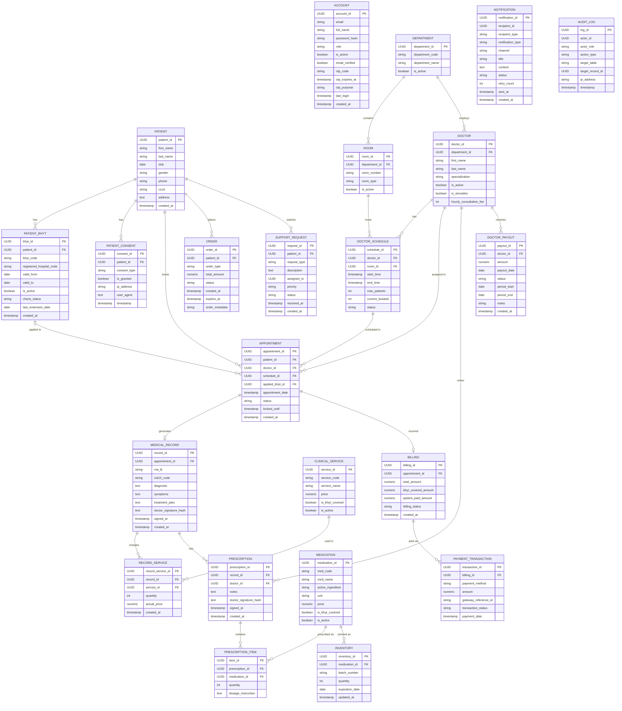

# Healthcare System Database ERD

Here is the Entity Relationship Diagram for the current database schema based on the SQLAlchemy models defined in the `app/models` directory.

```mermaid
erDiagram
    ACCOUNT {
        UUID account_id PK
        string email
        string full_name
        string password_hash
        string role
        boolean is_active
        boolean email_verified
        string otp_code
        timestamp otp_expires_at
        string otp_purpose
        timestamp last_login
        timestamp created_at
    }
    PATIENT {
        UUID patient_id PK
        string first_name
        string last_name
        date dob
        string gender
        string phone
        string cccd
        text address
        timestamp created_at
    }
    PATIENT_BHYT {
        UUID bhyt_id PK
        UUID patient_id FK
        string bhyt_code
        string registered_hospital_code
        date valid_from
        date valid_to
        boolean is_active
        string check_status
        date last_extension_date
        timestamp created_at
    }
    PATIENT_CONSENT {
        UUID consent_id PK
        UUID patient_id FK
        string consent_type
        boolean is_granted
        string ip_address
        text user_agent
        timestamp timestamp
    }
    DEPARTMENT {
        UUID department_id PK
        string department_code
        string department_name
        boolean is_active
    }
    ROOM {
        UUID room_id PK
        UUID department_id FK
        string room_number
        string room_type
        boolean is_active
    }
    DOCTOR {
        UUID doctor_id PK
        UUID department_id FK
        string first_name
        string last_name
        string specialization
        boolean is_active
        boolean is_simulator
        int hourly_consultation_fee
    }
    DOCTOR_SCHEDULE {
        UUID schedule_id PK
        UUID doctor_id FK
        UUID room_id FK
        timestamp start_time
        timestamp end_time
        int max_patients
        int current_booked
        string status
    }
    APPOINTMENT {
        UUID appointment_id PK
        UUID patient_id FK
        UUID doctor_id FK
        UUID schedule_id FK
        UUID applied_bhyt_id FK
        timestamp appointment_date
        string status
        timestamp locked_until
        timestamp created_at
    }
    MEDICAL_RECORD {
        UUID record_id PK
        UUID appointment_id FK
        string ma_lk
        string icd10_code
        text diagnosis
        text symptoms
        text treatment_plan
        text doctor_signature_hash
        timestamp signed_at
        timestamp created_at
    }
    CLINICAL_SERVICE {
        UUID service_id PK
        string service_code
        string service_name
        numeric price
        boolean is_bhyt_covered
        boolean is_active
    }
    RECORD_SERVICE {
        UUID record_service_id PK
        UUID record_id FK
        UUID service_id FK
        int quantity
        numeric actual_price
        timestamp created_at
    }
    PRESCRIPTION {
        UUID prescription_id PK
        UUID record_id FK
        UUID doctor_id FK
        text notes
        text doctor_signature_hash
        timestamp signed_at
        timestamp created_at
    }
    MEDICATION {
        UUID medication_id PK
        string med_code
        string med_name
        string active_ingredient
        string unit
        numeric price
        boolean is_bhyt_covered
        boolean is_active
    }
    PRESCRIPTION_ITEM {
        UUID item_id PK
        UUID prescription_id FK
        UUID medication_id FK
        int quantity
        text dosage_instruction
    }
    INVENTORY {
        UUID inventory_id PK
        UUID medication_id FK
        string batch_number
        int quantity
        date expiration_date
        timestamp updated_at
    }
    BILLING {
        UUID billing_id PK
        UUID appointment_id FK
        numeric total_amount
        numeric bhyt_covered_amount
        numeric patient_paid_amount
        string billing_status
        timestamp created_at
    }
    PAYMENT_TRANSACTION {
        UUID transaction_id PK
        UUID billing_id FK
        string payment_method
        numeric amount
        string gateway_reference_id
        string transaction_status
        timestamp payment_date
    }
    DOCTOR_PAYOUT {
        UUID payout_id PK
        UUID doctor_id FK
        numeric amount
        date payout_date
        string status
        date period_start
        date period_end
        string notes
        timestamp created_at
    }
    ORDER {
        UUID order_id PK
        UUID patient_id FK
        string order_type
        numeric total_amount
        string status
        timestamp created_at
        timestamp expires_at
        string order_metadata
    }
    NOTIFICATION {
        UUID notification_id PK
        UUID recipient_id
        string recipient_type
        string notification_type
        string channel
        string title
        text content
        string status
        int retry_count
        timestamp sent_at
        timestamp created_at
    }
    SUPPORT_REQUEST {
        UUID request_id PK
        UUID patient_id FK
        string request_type
        text description
        UUID assigned_to
        string priority
        string status
        timestamp resolved_at
        timestamp created_at
    }
    AUDIT_LOG {
        UUID log_id PK
        UUID actor_id
        string actor_role
        string action_type
        string target_table
        UUID target_record_id
        string ip_address
        timestamp timestamp
    }

    PATIENT ||--o{ PATIENT_BHYT : "has"
    PATIENT ||--o{ PATIENT_CONSENT : "has"
    PATIENT ||--o{ APPOINTMENT : "books"
    PATIENT ||--o{ ORDER : "places"
    PATIENT ||--o{ SUPPORT_REQUEST : "submits"
    
    DEPARTMENT ||--o{ ROOM : "contains"
    DEPARTMENT ||--o{ DOCTOR : "employs"
    
    DOCTOR ||--o{ DOCTOR_SCHEDULE : "has"
    DOCTOR ||--o{ APPOINTMENT : "assigned to"
    DOCTOR ||--o{ PRESCRIPTION : "writes"
    DOCTOR ||--o{ DOCTOR_PAYOUT : "receives"
    
    ROOM ||--o{ DOCTOR_SCHEDULE : "hosts"
    
    DOCTOR_SCHEDULE ||--o{ APPOINTMENT : "scheduled in"
    PATIENT_BHYT |o--o{ APPOINTMENT : "applied to"
    
    APPOINTMENT ||--o| MEDICAL_RECORD : "generates"
    APPOINTMENT ||--o| BILLING : "incurred"
    
    MEDICAL_RECORD ||--o{ RECORD_SERVICE : "includes"
    CLINICAL_SERVICE ||--o{ RECORD_SERVICE : "used in"
    MEDICAL_RECORD ||--o{ PRESCRIPTION : "has"
    
    PRESCRIPTION ||--o{ PRESCRIPTION_ITEM : "contains"
    MEDICATION ||--o{ PRESCRIPTION_ITEM : "prescribed as"
    MEDICATION ||--o{ INVENTORY : "stocked as"
    
    BILLING ||--o{ PAYMENT_TRANSACTION : "paid via"
```
